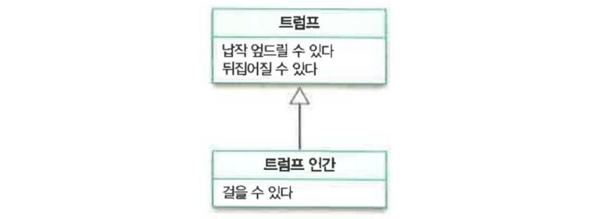

# 타입과 추상화
> 추상화란 불필요한 부분을 무시함으로써 현실에 존재하는 복잡성을 극복하는 것이다.

## 추상화를 통한 복잡성 극복
- 추상화 : 정확성을 버리고 **목적**에 집중 -> 단순화, 직관적
- 추상화 방법
  1. 구체적인 사물들 간의 공통점은 취하고 차이점은 버리는 일반화를 통해 단순하게 만든다. -> 분류
  2. 중요한 부분을 강조하기 위해 불필요한 세부사항을 제거함으로써 단순하게 만든다. -> 일반화/특수화

## 객체지향과 추상화
- 객체 : 명확한 경계를 가지고 서로 구별할 수 있는 구체적인 사람이나 사물 / 특정 개념을 적용할 수 있는 구체적인 사물
- 객체들의 차이점을 의도적으로 무시하고 공통점만을 강조함으로써 그룹화(단순화)하는 것 또한 추상화의 일종이다.
- 개념 (concept) : 공통점을 기반으로 객체들을 묶기 위한 아이디어/관념

    개념을 이용하면 객체를 여러 그룹으로 분류할 수 있다. 객체가 개념 그룹의 일원이 될 때, 해당 객체를 그 개념의 인스턴스 (instance) 라고 한다.

### 개념의 세 가지 관점
- 심볼 (symbol) : 개념을 가리키는 이름/명칭
- 내연 (intension) : 개념의 의미. 개념을 객체에 적용할 수 있는지 여부를 판단하기 위한 조건
- 외연 (extension) : 개념에 속하는 모든 객체(인스턴스)의 집합 (set)

### 분류는 추상화를 위한 도구다
- 분류 : 객체에 특정 개념을 적용함으로써 객체 집합에 포함지키거나 포함시키지 않는 작업
- 개념은 객체들의 복잡성을 극복하기 위한 추상화 도구다. 무수한 객체를 개념의 틀로 걸러가며 추상화하면 복잡함을 단순화할 수 있다.

## 타입
- 타입은 개념이다. 완전 똑같은 용어. 컴퓨터 공학자들이 좀 더 세련된 용어를 가져온 것
### 데이터 타입
- 타입은 데이터의 **용도와 행동**에 따라 분류한 결과이다. -> 타입 시스템이 구축됨
- 타입에 속한 데이터를 메모리에 어떻게 표현하는지는 외부로부터 철저하게 감춰진다. 개발자는 메모리 상에서 타입 표현 방식을 몰라도 아무 지장이 없다.
### 객체의 타입
- 객체는 변할 수 있는 상태와 행동을 갖는다.
- 객체가 수행하는 **행동(책임)에 따라 객체의 타입을 결정**할 수 있다. (RDD, 다형성)
  - = 외부에는 속성(데이터)를 감춰야 한다.
  - 이런 측면에서 인터페이스는 객체 지향 설계를 하는 좋은 도구가 되는 것 같다. 상태는 존재하지 않고 행동(책임)만 존재하니까!
- 객체의 내부적인 표현은 외부로부터 철저하게 감춰진다. (캡슐화)
    
  - 객체 내부 표현 방식이 다르더라도 동일하게 행동한다면, 그 객체들은 동일한 타입에 속한다.
  - 내부 표현 방식이 다르면 동일한 메시지를 처리하는 방식도 다를 수밖에 없다. (다형성 = 동일한 요청에 대해 서로 다른 방식으로 응답할 수 있는 능력)

## 타입의 계층 (상속)
트럼프인간 타입의 외연 ⊂ 트럼프 타입의 외연 : 특수화 ⊂ 일반화 관계
 
- 타입 간에는 일반화/특수화 관계가 존재할 수 있다. **이 또한 객체의 행동에 의해 결정된다.**
- **일반화 = SuperType = 부모**
  - 일반적인 타입 : 보편적
  - 타입의 내연, 즉 행동의 가짓수는 적지만, 타입의 외연인 집합의 크기는 크다.
- **특수화 = SubType = 자식**
  - 특수한 타입 : (일반적인 타입이 가진 모든 타입 + 자신에게만 특수화된 행동) 모두를 가진 타입
  - 타입의 내연, 즉 행동의 가짓수는 많지만, 타입의 외연인 집합의 크기는 작다.

이러한 특성 때문에 서브타입(특수화)은 항상 슈퍼타입(일반화)을 대체할 수 있어야 한다. (LSP, 리스코프 치환 원칙)

- 부모(슈퍼타입)가 위, 자식(서브타입)이 아래
- 둘을 빈 삼각형 화살표로 연결
- 자식(서브타입)에서는 중복된 행동 생략 가능

## 정적 모델
타입을 사용하는 이유 : 동적으로 변하는 객체의 상태는 너무 복잡하기 때문에 단순화하기 위해서!

(엘리스의 키는 시시각각 변하지만, '키'라는 상태로 정의하면 정적으로 다룰 수 있게 된다. = '키' 변수를 다룰 수 있는 방법이 고정된다.)
- 타입은 추상화다.
- 타입을 이용하면 객체의 상태가 동적이라는 특징을 추상화할 수 있다. 상태를 다루는 방법이 고정됨으로써 복잡성이 단순화된다.
- 동적 모델 = 객체 다이어그램 (모델) : 객체가 특정 시점에서 어떤 상태를 가지는지 포착하는 것
- 정적 모델 = 타입 다이어그램 (모델) :  객체의 상태와 행동을 시간에 독립적으로 표현하는 것. 객체가 속한 타입의 정적인 모습을 표현하는 것. 
  
  -> 타입, 즉 정적 모델을 구현하는 방법 = 클래스